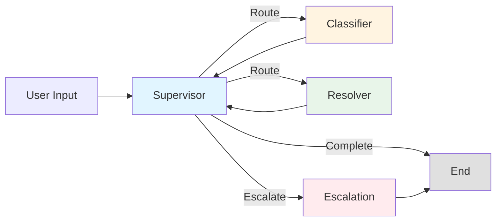

# UDA-Hub: Universal Decision Agent for Customer Support

UDA-Hub is an intelligent, multi-agent decision suite built with LangChain and LangGraph, designed to resolve customer support tickets across multiple platforms. The system uses a sophisticated multi-agent architecture to understand, classify, route, and resolve customer support issues autonomously.

## Project Overview

UDA-Hub is designed to plug into existing customer support systems (Zendesk, Intercom, Freshdesk, internal CRMs) and intelligently resolve tickets. Unlike traditional FAQ bots, UDA-Hub acts as an operational brain that:

- **Understands** customer tickets across channels
- **Decides** which agent or tool should handle each case
- **Retrieves** or infers answers when possible
- **Escalates** or summarizes issues when necessary
- **Learns** from interactions by updating long-term memory

## Key Capabilities

### Multi-Agent Architecture
- **Supervisor Agent**: Routes tickets to appropriate specialized agents
- **Classifier Agent**: Analyzes and classifies tickets by issue type and urgency
- **Resolver Agent**: Attempts to resolve tickets using available tools and knowledge base
- **Escalation Agent**: Handles tickets that require human intervention

### Input Handling
- Accepts incoming support tickets in natural language with metadata
- Supports multiple channels (chat, email, etc.)
- Handles ticket history and context

### Decision Routing and Resolution
- Routes tickets to the right agent based on classification
- Retrieves relevant knowledge via RAG (Retrieval-Augmented Generation)
- Resolves or escalates based on confidence and context
- Maintains conversation state throughout the session

### Memory Integration
- **Short-term memory**: Maintains context during the same session
- **Long-term memory**: Stores and recalls preferences and prior resolutions
- Uses LangGraph's checkpointer for state persistence

## Project Structure

```
Project 3 - Autonomous Knowledge Agent/
├── agentic/
│   ├── agents/
│   │   ├── __init__.py
│   │   ├── supervisor.py      # Routes tickets to appropriate agents
│   │   ├── classifier.py      # Classifies tickets by type and urgency
│   │   ├── resolver.py        # Resolves tickets using tools
│   │   └── escalation.py      # Handles escalated tickets
│   ├── tools/
│   │   ├── __init__.py
│   │   ├── rag_tool.py        # Knowledge base search tool
│   │   ├── db_tools.py        # Database query tools
│   │   └── refund_tool.py     # Refund processing tool
│   ├── design/
│   │   └── README.md          # Architecture and design documentation
│   └── workflow.py            # Main LangGraph orchestrator
├── data/
│   ├── core/                  # UDA-Hub core database
│   ├── external/              # External system data (CultPass)
│   │   ├── cultpass_articles.jsonl
│   │   ├── cultpass_users.jsonl
│   │   └── cultpass_experiences.jsonl
│   └── models/
│       ├── cultpass.py        # CultPass database models
│       └── udahub.py          # UDA-Hub database models
├── 01_external_db_setup.ipynb # Setup external CultPass database
├── 02_core_db_setup.ipynb     # Setup UDA-Hub core database
├── 03_agentic_app.ipynb       # Main application notebook
├── utils.py                   # Utility functions
├── requirements.txt           # Python dependencies
└── README.md                  # This file
```

## Getting Started

### Prerequisites

- Python 3.9+
- OpenAI API key
- SQLite (included with Python)

### Installation

1. **Clone or navigate to the project directory:**
   ```bash
   cd "Project 3 - Autonomous Knowledge Agent"
   ```

2. **Create a virtual environment (recommended):**
   ```bash
   python -m venv venv
   source venv/bin/activate  # On Windows: venv\Scripts\activate
   ```

3. **Install dependencies:**
   ```bash
   pip install -r requirements.txt
   ```

4. **Set up environment variables:**
   Create a `.env` file in the project root:
   ```env
   OPENAI_API_KEY=your_openai_api_key_here
   ```

### Database Setup

1. **Run the external database setup:**
   Open and run `01_external_db_setup.ipynb` to:
   - Create the CultPass external database
   - Populate with users, subscriptions, experiences, and reservations

2. **Run the core database setup:**
   Open and run `02_core_db_setup.ipynb` to:
   - Create the UDA-Hub core database
   - Set up accounts, knowledge base articles, and initial tickets

### Running the Application

1. **Open the main application notebook:**
   ```bash
   jupyter notebook 03_agentic_app.ipynb
   ```

2. **Run all cells** to initialize the orchestrator

3. **Start the chat interface:**
   The notebook will launch an interactive chat interface where you can:
   - Ask questions about CultPass
   - Report issues
   - Request support

## Architecture

For detailed architecture and design documentation, see [`agentic/design/README.md`](agentic/design/README.md).

### Workflow

The system follows this workflow:



**Process Steps**:

1. **Supervisor** receives the ticket and routes it
2. **Classifier** analyzes and classifies the ticket
3. **Supervisor** routes to resolver based on classification
4. **Resolver** attempts to resolve using tools and knowledge base
5. **Supervisor** checks if resolution is satisfactory or escalation needed
6. **Escalation** handles cases requiring human intervention

### Agents

#### Supervisor Agent
- Routes tickets between agents
- Monitors conversation state
- Decides when to end or escalate

#### Classifier Agent
- Classifies tickets into categories:
  - `login`: Account access issues
  - `subscription`: Subscription-related questions
  - `reservation`: Booking and reservation issues
  - `billing`: Payment and billing questions
  - `technical`: App and technical problems
  - `other`: Miscellaneous issues
- Assesses urgency (low, medium, high, critical)
- Provides confidence scores

#### Resolver Agent
- Uses tools to gather information
- Searches knowledge base via RAG
- Queries databases for user/subscription/reservation data
- Provides solutions and answers

#### Escalation Agent
- Handles tickets requiring human intervention
- Creates ticket summaries
- Generates ticket references
- Sets expectations for response times

### Tools

#### RAG Tool (`rag_tool.py`)
- Searches the knowledge base using semantic search
- Returns relevant articles and information
- Falls back to keyword matching if embeddings unavailable

#### Database Tools (`db_tools.py`)
- `lookup_user`: Find user information by ID or email
- `lookup_subscription`: Get subscription details
- `lookup_reservations`: Query user reservations
- `lookup_experience`: Find experience information

#### Refund Tool (`refund_tool.py`)
- Processes refund requests (requires approval)
- Logs refund requests for manual review

## Usage Examples

### Example 1: Login Issue
```
User: I can't log in to my CultPass account.
→ Classifier: login issue, medium urgency
→ Resolver: Searches knowledge base, provides password reset instructions
```

### Example 2: Subscription Question
```
User: What's included in my subscription?
→ Classifier: subscription issue, low urgency
→ Resolver: Looks up user subscription, searches knowledge base, provides details
```

### Example 3: Escalation
```
User: I need to speak to a human agent about a refund.
→ Classifier: billing issue, high urgency
→ Resolver: Attempts to help
→ Supervisor: Detects escalation request
→ Escalation: Creates ticket, provides reference number
```

## Testing

The system includes test cells in the setup notebooks to verify:
- Database setup and data population
- Knowledge base article loading
- User and ticket creation

Run the test cells in each notebook to verify setup.

## Built With

- [LangChain](https://www.langchain.com/) - LLM application framework
- [LangGraph](https://github.com/langchain-ai/langgraph) - Multi-agent orchestration
- [OpenAI](https://openai.com/) - GPT models for agents
- [SQLAlchemy](https://www.sqlalchemy.org/) - Database ORM
- [FAISS](https://github.com/facebookresearch/faiss) - Vector similarity search (optional)

## Key Features

1. **Multi-Agent System**: Specialized agents for different tasks
2. **Intelligent Routing**: Supervisor routes tickets based on state
3. **RAG Integration**: Knowledge base search for accurate answers
4. **Database Integration**: Query external and core databases
5. **State Management**: Persistent conversation state with checkpointer
6. **Escalation Handling**: Smooth handoff to human agents

## Future Enhancements

- Integration with external support platforms (Zendesk, Intercom)
- Long-term memory storage in database
- Analytics and reporting dashboard
- Multi-language support
- Voice interface support

## License

[License](../LICENSE.md)

## Notes

- The system uses `gpt-4o-mini` by default for cost efficiency
- Database paths are relative to the project root
- The checkpointer uses in-memory storage (can be upgraded to database-backed)
- All tools require proper database setup before use
