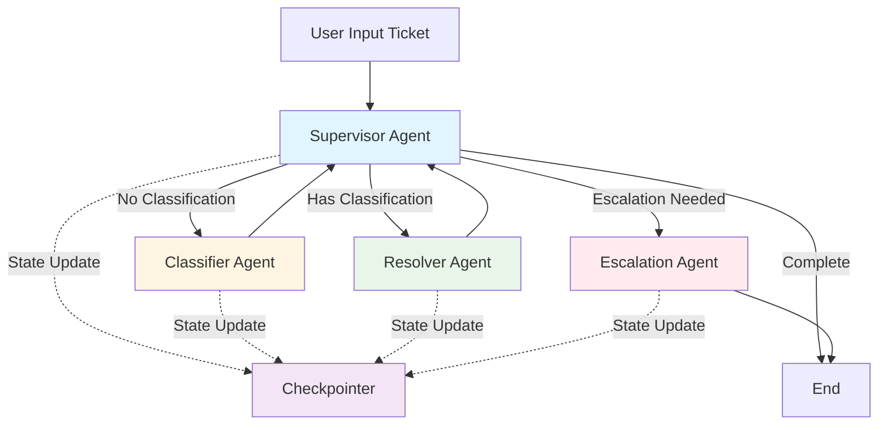
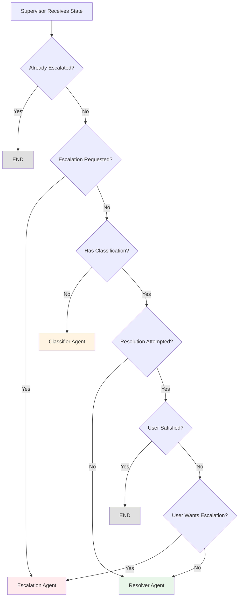
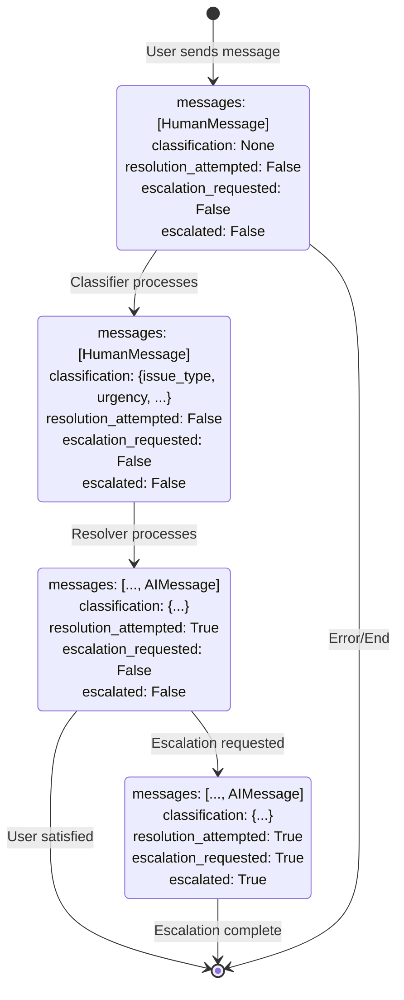
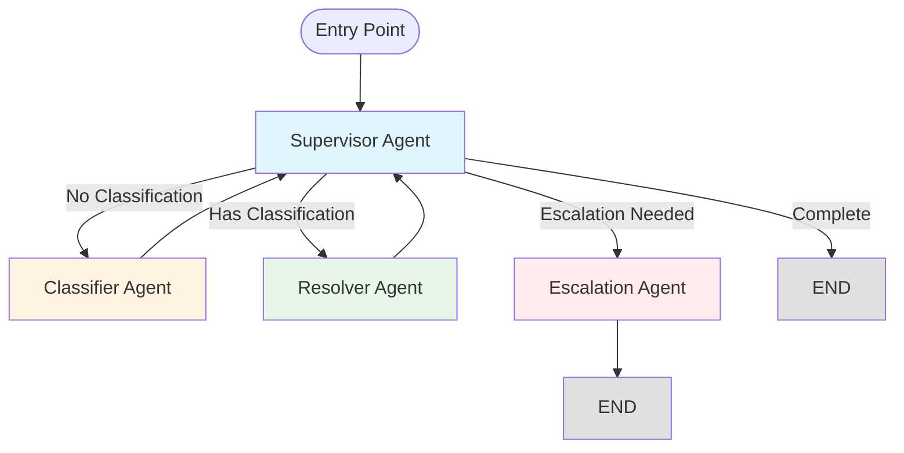
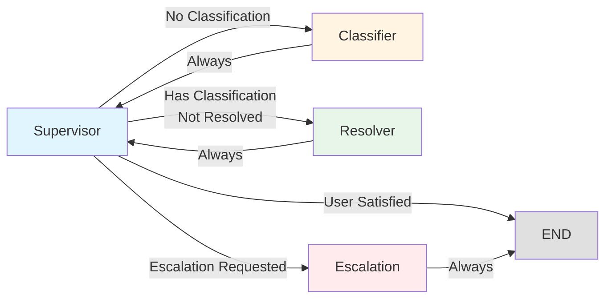

# UDA-Hub Architecture & Design

This document describes the architecture and design decisions for the UDA-Hub multi-agent system.

## System Architecture

### High-Level Overview



## Agent Design

### 1. Supervisor Agent

**Purpose**: Central routing and orchestration hub

**Responsibilities**:
- Analyze current conversation state
- Route to appropriate agent based on state
- Monitor resolution progress
- Decide when to escalate or end conversation

**State Dependencies**:
- `classification`: Whether ticket has been classified
- `resolution_attempted`: Whether resolver has tried to resolve
- `escalation_requested`: Whether user requested escalation
- `escalated`: Whether ticket has been escalated

**Routing Logic**:



### 2. Classifier Agent

**Purpose**: Analyze and categorize incoming tickets

**Responsibilities**:
- Extract issue type from ticket content
- Assess urgency level
- Provide confidence score
- Generate summary and tags

**Output Schema**:
```python
{
    "issue_type": "login" | "subscription" | "reservation" | "billing" | "technical" | "other",
    "urgency": "low" | "medium" | "high" | "critical",
    "confidence": float (0.0 to 1.0),
    "tags": str,
    "summary": str
}
```

**Implementation**:
- Uses structured output with Pydantic models
- Analyzes conversation history for context
- Provides fallback classification if LLM fails

### 3. Resolver Agent

**Purpose**: Attempt to resolve tickets using available tools

**Responsibilities**:
- Use tools to gather information
- Search knowledge base via RAG
- Query databases for user/subscription data
- Provide solutions and answers
- Detect when escalation is needed

**Available Tools**:
- `search_knowledge_base`: RAG search over knowledge articles
- `lookup_user`: Find user information
- `lookup_subscription`: Get subscription details
- `lookup_reservations`: Query user reservations
- `lookup_experience`: Find experience information
- `process_refund`: Handle refund requests (with approval)

**Implementation**:
- Uses LangGraph's `create_react_agent` for tool usage
- Incorporates classification context
- Handles tool errors gracefully
- Can trigger escalation if resolution fails

### 4. Escalation Agent

**Purpose**: Handle tickets requiring human intervention

**Responsibilities**:
- Acknowledge customer concern
- Summarize issue clearly
- Generate ticket reference
- Set expectations for response time
- Create summary for human agents

**Output**:
- Professional escalation message
- Ticket reference number (ESC-XXXX)
- Summary of issue and resolution attempts
- Expected response time (24 hours)

## State Management

### AgentState Schema

```python
class AgentState(TypedDict, total=False):
    messages: Annotated[list[BaseMessage], add]  # Conversation history
    classification: dict | None                   # Ticket classification
    resolution_attempted: bool                    # Resolution status
    escalation_requested: bool                    # Escalation flag
    escalated: bool                               # Escalation status
```

### State Flow



**State Transitions**:

1. **Initial State**: User sends message
   - `messages`: [HumanMessage]
   - `classification`: None
   - `resolution_attempted`: False
   - `escalation_requested`: False
   - `escalated`: False

2. **After Classification**:
   - `classification`: {issue_type, urgency, confidence, tags, summary}

3. **After Resolution Attempt**:
   - `resolution_attempted`: True
   - `messages`: [..., AIMessage with response]

4. **After Escalation**:
   - `escalation_requested`: True
   - `escalated`: True
   - `messages`: [..., AIMessage with escalation info]

### Checkpointer

- Uses `MemorySaver` for in-memory state persistence
- Thread-based isolation (via `thread_id`)
- Maintains conversation context across turns
- Can be upgraded to database-backed storage

## Tool Design

### RAG Tool

**Purpose**: Semantic search over knowledge base

**Implementation**:
- Uses FAISS vector store with OpenAI embeddings
- Falls back to keyword matching if embeddings unavailable
- Returns top 3 most relevant articles
- Formats results for easy consumption

**Fallback Strategy**:
- If embeddings fail → keyword matching
- If no results → informative error message

### Database Tools

**Design Pattern**: Each tool is a LangChain Tool wrapper around SQLAlchemy queries

**Tools**:
1. **User Lookup**: Find by user_id or email
2. **Subscription Lookup**: Get subscription details by user_id
3. **Reservation Lookup**: Query reservations with optional status filter
4. **Experience Lookup**: Find by experience_id or title search

**Error Handling**:
- Returns informative error messages if not found
- Handles missing relationships gracefully
- Provides context in error messages

### Refund Tool

**Purpose**: Process refund requests (requires approval)

**Design**:
- Logs refund requests for manual review
- Requires reason and optional amount
- Returns ticket reference for tracking
- Never processes automatically (safety)

## Workflow Design

### Graph Structure



### Routing Logic

The supervisor uses conditional edges to route based on state. The routing decision tree:



### Edge Conditions

1. **supervisor → classifier**: No classification exists
2. **classifier → supervisor**: Always (to route to resolver)
3. **supervisor → resolver**: Has classification, resolution not attempted
4. **resolver → supervisor**: Always (to check if escalation needed)
5. **supervisor → escalation**: Escalation requested
6. **supervisor → end**: User satisfied or conversation complete
7. **escalation → end**: Always

## Design Decisions

### 1. Multi-Agent vs Single Agent

**Decision**: Separate specialized agents

**Rationale**:
- Each agent can have optimized prompts
- Easier to maintain and debug
- Clear separation of concerns
- Allows independent testing

### 2. Supervisor Pattern

**Decision**: Central supervisor for routing

**Rationale**:
- Single point of control
- Easy to modify routing logic
- State-aware routing decisions
- Prevents infinite loops

### 3. State Persistence

**Decision**: Use LangGraph checkpointer

**Rationale**:
- Built-in state management
- Thread-based isolation
- Easy to upgrade to persistent storage
- Maintains conversation context

### 4. Tool Integration

**Decision**: LangChain Tools with ReAct agent

**Rationale**:
- Standard interface for tools
- Automatic tool selection
- Error handling built-in
- Easy to add new tools

### 5. RAG Implementation

**Decision**: FAISS with fallback to keyword matching

**Rationale**:
- Semantic search when available
- Graceful degradation
- No hard dependency on embeddings
- Works in all environments

## Error Handling

### Agent Errors

- **Classifier fails**: Fallback to "other" category with low confidence
- **Resolver fails**: Trigger escalation automatically
- **Tool errors**: Return informative error messages
- **State errors**: Reset to safe defaults

### Database Errors

- **Connection errors**: Return user-friendly message
- **Query errors**: Log and escalate
- **Missing data**: Inform user and suggest alternatives

## Performance Considerations

### Optimization Strategies

1. **Lazy Tool Loading**: Tools created only when needed
2. **Caching**: Consider caching knowledge base embeddings
3. **Batch Processing**: Could batch multiple queries
4. **Async Operations**: Could use async for I/O operations

### Scalability

- **Horizontal Scaling**: Stateless agents can scale horizontally
- **Database**: SQLite suitable for development, PostgreSQL for production
- **Checkpointer**: Can upgrade to Redis or database-backed storage
- **Vector Store**: FAISS can be replaced with Pinecone/Weaviate for scale

## Security Considerations

### Data Access

- Tools only access necessary data
- No direct database access from agents
- User data filtered by account_id

### Refund Tool

- Requires explicit approval
- Never processes automatically
- Logs all requests for audit

### API Keys

- Stored in environment variables
- Never hardcoded
- Should use secret management in production

## Future Enhancements

### Short-term

1. **Long-term Memory**: Store preferences and history in database
2. **Analytics**: Track resolution rates and agent performance
3. **Multi-language**: Support multiple languages
4. **Voice Interface**: Add voice input/output

### Long-term

1. **Learning System**: Learn from resolved tickets
2. **Predictive Routing**: Predict best agent before classification
3. **Sentiment Analysis**: Detect frustrated customers early
4. **Integration**: Connect to Zendesk, Intercom, etc.

## Testing Strategy

### Unit Tests

- Test each agent independently
- Mock tools and LLM responses
- Test state transitions

### Integration Tests

- Test full workflow end-to-end
- Test with real database
- Test error scenarios

### Performance Tests

- Measure response times
- Test with high load
- Profile tool usage

## Monitoring & Observability

### Metrics to Track

- Ticket resolution rate
- Average resolution time
- Escalation rate
- Agent usage distribution
- Tool usage frequency
- Error rates

### Logging

- Log all state transitions
- Log tool invocations
- Log errors with context
- Log user interactions (anonymized)
